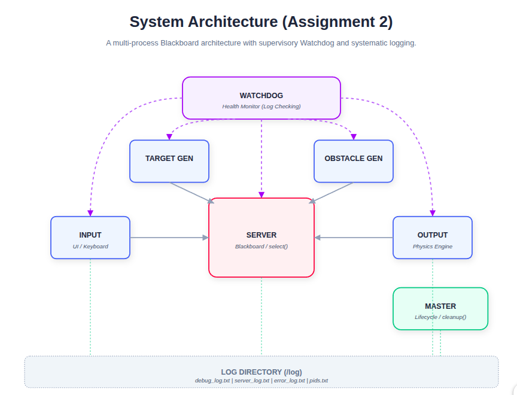

# Drone Simulator - Assignment 1 & 2

**Author:** Amr Magdy Mohamed Elsayed Abdalla
**Course:** Advanced Robotics Programming

---

## 🚀 Assignment 2: Corrections & Integrated Watchdog

This repository has been updated with Assignment 2 requirements and significant fixes based on the initial evaluation.

### 🛠️ Changelog (Fixes from Assignment 1)

1. **Physics Engine Stability (Anti-Teleportation):**
   - **Fix:** Clamped the maximum repulsive force to 20.0 and increased the minimum distance threshold to 1.0 in `output_window.c`.
   - **Result:** The drone no longer jumps across the screen when colliding with walls or obstacles.

2. **Systematic Debugging:**
   - **Fix:** Implemented `log_debug_system()` in `common_utils.c`.
   - **Result:** All critical events (Inputs, Physics states, Collisions) are now logged with PIDs and timestamps in `log/debug_log.txt`.

3. **Window Resize Handling:**
   - **Fix:** Enhanced the `KEY_RESIZE` handler in `output_window.c` to reset ncurses buffers and immediately re-clamp coordinates.
   - **Result:** No more visual glitches or drone "disappearance" after resizing.

### 🛡️ New Features
- **Watchdog Process:** Supervisory process monitoring component heartbeats.
- **Detailed Logging:** Systematic logs in `/log` with `flock` protection.

---

## How to Run
1. **Compile:** `./compile.sh`
2. **Execute:** `./run.sh`
